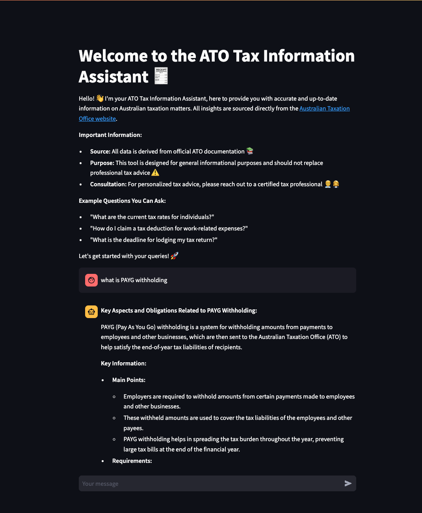

# ATO Chatbot

A RAG-based chatbot system for Australian Taxation Office (ATO) information retrieval and assistance, powered by data sourced from ato.gov.au.


## Live Demo
https://ato-chat.streamlit.app/



*Figure 1: Streamlit Chat Interface with example conversation*


## Overview

This project implements a Retrieval-Augmented Generation (RAG) chatbot system specifically designed for ATO-related queries. It consists of two main components:

1. **Data Pipeline & Model Training**: A modular pipeline built with ZenML for data processing and index creation
2. **Interactive Interface**: A Streamlit-based chat interface for user interactions

## Architecture


## Technology Stack

- **Data Collection & Processing**
  - [Firecrawl](https://github.com/brave-experiments/firecrawl) - Web crawling and content extraction
  - [ZenML](https://zenml.io/) - MLOps pipeline orchestration
  - [Qdrant](https://qdrant.tech/) - Vector database for embeddings storage

- **Machine Learning & AI**
  - [OpenAI](https://openai.com/) - Large Language Model API
  - [LlamaIndex](https://www.llamaindex.ai/) - RAG framework and indexing

- **Backend & Infrastructure**
  - [Docker](https://www.docker.com/) - Containerization
  - [MongoDB](https://www.mongodb.com/) - Document storage

- **Frontend**
  - [Streamlit](https://streamlit.io/) - Interactive web interface
  - [Streamlit-Chat](https://streamlit.io/components) - Chat UI components

## Components

### 1. Data Pipeline

The data pipeline is built using ZenML and consists of several key steps:

1. **Data Collection**: Uses Firecrawl to extract content from ATO pages
2. **Data Cleaning**: Processes and filters the collected data
3. **Index Creation**: Creates embeddings and stores them in Qdrant


*Figure 2: ZenML Pipeline Workflow showing data processing steps*

Key pipeline components:

```
python:src/ato_chatbot/pipelines/simple_index_pipeline.py
```


### 2. Chat Interface

The chat interface is built with Streamlit and implements a 3-step RAG process:

1. **Query Rephrasing**: Improves query understanding
2. **Knowledge Retrieval**: Fetches relevant information from Qdrant
3. **Response Generation**: Uses OpenAI to generate contextual responses


Key interface components:

```
python:src/ato_chatbot/chat_interface.py
```

## Setup

### Prerequisites

- Python 3.12+g
- Docker and Docker Compose
- OpenAI API key

### Installation

1. Clone the repository
2. Install dependencies:

```
uv install
```

3. Start required services:

```bash
make up
```


### Running the Application

1. Train the model:

```bash
make zen_run_simple_index
```


2. Start the chat interface:

```bash
make streamlit
```


## Dependencies

Key dependencies include:

```
toml:pyproject.toml
```


## License

Apache License 2.0